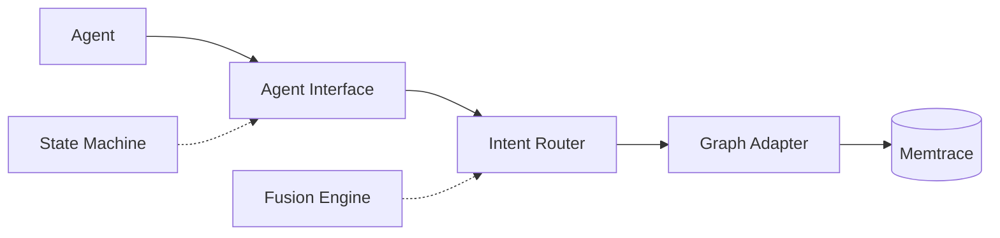

# Memtrace Middleware

[](https://github.com/magalz/memtrace-middleware/actions/workflows/ci.yml)


A structured middleware for AI agent frameworks that routes intents to Memtrace's graph intelligence via a three-layer architecture: **Agent Interface → Intent Router → Graph Adapter**.

## Zero-Config Install

```bash
npm install -g @memtrace/middleware
memtrace init
```

## One-Liner Demo

```bash
npx memtrace-demo
```

## Architecture



Three-layer design:

- **Agent Interface** — framework-agnostic `ToolProvider`, `ContextBuilder`, `Session` contracts
- **Intent Router** — classifies and plans graph queries per intent type
- **Graph Adapter** — executes queries against Memtrace with health probes and circuit breaker

## Quick Start (<5 min)

```bash
pnpm install
pnpm build
pnpm start
```

## Status Display

```text
╔══════════════════════════════════╗
║  Tier: full                      ║
║  Uptime: 1h 23m                  ║
║  Intents: find_code, get_impact  ║
║  Success: 142  │  Fail: 3        ║
║  Confidence: p50 0.95 p95 0.99   ║
╚══════════════════════════════════╝
```

## Troubleshooting

### Memtrace not found

Ensure the Memtrace daemon is running: `memtrace start`

### Adapter mismatch

Check your adapter version matches the middleware: `memtrace --version`

### Degradation notices explained

- **IntentReduced** — queries run sequentially instead of parallel
- **Passthrough** — raw query pass-through, no fusion
- **FailClosed** — Memtrace unreachable, requests rejected gracefully
