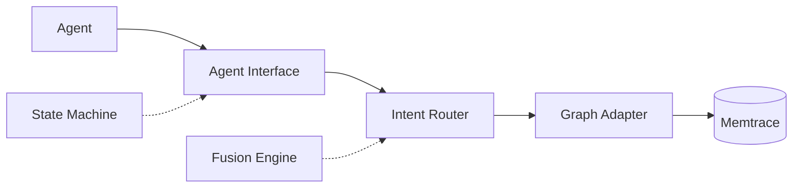

# Memtrace Middleware

[](https://github.com/magalz/memtrace-middleware/actions/workflows/ci.yml)


A structured middleware for AI agent frameworks that routes intents to Memtrace's graph intelligence via a three-layer architecture: **Agent Interface → Intent Router → Graph Adapter**.

## Zero-Config Install

```bash
npm install -g @memtrace/middleware
mtm init
```

### Local Development Install

```bash
git clone https://github.com/magalz/memtrace-middleware.git
cd memtrace-middleware
pnpm install
pnpm build
pnpm link --global .
```

Then `mtm` is available globally from the local build.

To uninstall:

```bash
pnpm unlink --global @memtrace/middleware
```

## One-Liner Demo

```bash
npx memtrace-demo
```

## Architecture


```mermaid
graph LR
    Agent --> Adapter[Agent Interface]
    Adapter --> Router[Intent Router]
    Router --> Backend[Graph Adapter]
    Backend --> Memtrace[(Memtrace)]
    Fusion[Fusion Engine] -.-> Router
    Degradation[State Machine] -.-> Adapter
```

Three-layer design:

- **Agent Interface** — framework-agnostic `ToolProvider`, `ContextBuilder`, `Session` contracts
- **Intent Router** — classifies and plans graph queries per intent type
- **Graph Adapter** — executes queries against Memtrace with health probes and circuit breaker

## Quick Start (<5 min)

```bash
pnpm install
pnpm build
pnpm start
```

## Status Display

```text
╔══════════════════════════════════╗
║  Tier: full                      ║
║  Uptime: 1h 23m                  ║
║  Intents: find_code, get_impact  ║
║  Success: 142  │  Fail: 3        ║
║  Confidence: p50 0.95 p95 0.99   ║
╚══════════════════════════════════╝
```

## Telemetry API

Export the 5 core KPIs as structured JSON:

```bash
mtm telemetry                 # pretty-printed JSON
mtm telemetry --compact       # single-line JSON
```

Returns `schema_version: "1.0"` with: query success rates per intent, force-tier override count, latency percentiles (p50/p95/p99), Memtrace probe uptime, classification confidence distribution, buffer utilization, and pruning stats.

The `memtrace_telemetry` MCP tool exposes the same data to agents.

## Telemetry Dashboard

Live-updating terminal dashboard with sparkline latency history and per-release drift detection:

```bash
mtm dashboard                 # live TUI (500ms refresh, press 'q' to quit)
mtm dashboard --watch         # hot-reload thresholds on config change
mtm dashboard --set-baseline  # save current KPIs as baseline for drift comparison
```

Shows: health dot (green/yellow/red), current tier, uptime, 5 KPI panels with threshold coloring, latency sparkline (last 60 data points), per-release drift arrows, and pruning stats.

## Context Pruning

Long-running agent sessions automatically prune stale conversation history to stay within token budget. Configurable via `middleware.json`:

```json
{
  "pruning": {
    "enabled": true,
    "max_turn_threshold": 20,
    "recency_window": 5
  }
}
```

Retains: last N turns (recency) + structurally-relevant turns (symbol overlap with current query) + MemFleet-annotated turns. Tokens saved reported in `--status` and dashboard.

## Troubleshooting

### Memtrace not found

Ensure the Memtrace daemon is running: `memtrace start`

### Adapter mismatch

Check your adapter version matches the middleware: `memtrace --version`

### Degradation notices explained

- **IntentReduced** — queries run sequentially instead of parallel
- **Passthrough** — raw query pass-through, no fusion
- **FailClosed** — Memtrace unreachable, requests rejected gracefully
